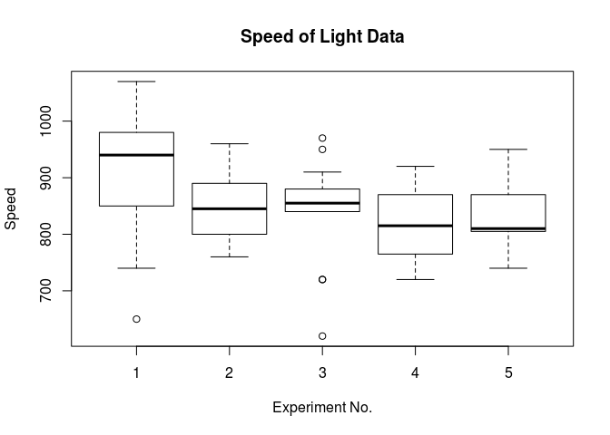

Replicate the examples found in `?morley` using tidy tools
----------------------------------------------------------

Here are the steps and output of the examples found in `?morley`.

    require(stats)
    require(graphics)
    michelson <- transform(morley,
                           Expt = factor(Expt), Run = factor(Run))
    xtabs(~ Expt + Run, data = michelson)  # 5 x 20 balanced (two-way)

    ##     Run
    ## Expt 1 2 3 4 5 6 7 8 9 10 11 12 13 14 15 16 17 18 19 20
    ##    1 1 1 1 1 1 1 1 1 1  1  1  1  1  1  1  1  1  1  1  1
    ##    2 1 1 1 1 1 1 1 1 1  1  1  1  1  1  1  1  1  1  1  1
    ##    3 1 1 1 1 1 1 1 1 1  1  1  1  1  1  1  1  1  1  1  1
    ##    4 1 1 1 1 1 1 1 1 1  1  1  1  1  1  1  1  1  1  1  1
    ##    5 1 1 1 1 1 1 1 1 1  1  1  1  1  1  1  1  1  1  1  1

    plot(Speed ~ Expt, data = michelson,
         main = "Speed of Light Data", xlab = "Experiment No.")

    fm <- aov(Speed ~ Run + Expt, data = michelson)
    summary(fm)

    ##             Df Sum Sq Mean Sq F value  Pr(>F)   
    ## Run         19 113344    5965   1.105 0.36321   
    ## Expt         4  94514   23629   4.378 0.00307 **
    ## Residuals   76 410166    5397                   
    ## ---
    ## Signif. codes:  0 '***' 0.001 '**' 0.01 '*' 0.05 '.' 0.1 ' ' 1

    fm0 <- update(fm, . ~ . - Run)
    anova(fm0, fm)

    ## Analysis of Variance Table
    ## 
    ## Model 1: Speed ~ Expt
    ## Model 2: Speed ~ Run + Expt
    ##   Res.Df    RSS Df Sum of Sq      F Pr(>F)
    ## 1     95 523510                           
    ## 2     76 410166 19    113344 1.1053 0.3632

### Challenges

Start by casting the `morley` data as a tibble rather than as a
data.frame.

    library(dplyr)

    ## 
    ## Attaching package: 'dplyr'

    ## The following objects are masked from 'package:stats':
    ## 
    ##     filter, lag

    ## The following objects are masked from 'package:base':
    ## 
    ##     intersect, setdiff, setequal, union

    x <- morley %>%
      dplyr::as_tibble()

Q1: How might you produce the contignecy table (2d counts) using tidy
tools?

Q2: How might you generate the figure using ggplot2 and friends? (Bonus,
can you make it a violin plot?)

Q3: How might you use tidy tools to extract coefficients and metrics out
of the models `fm` and `fm0`?
